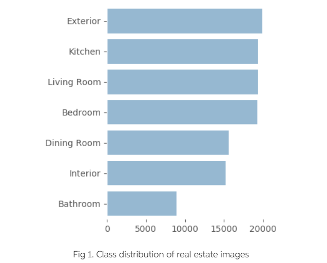
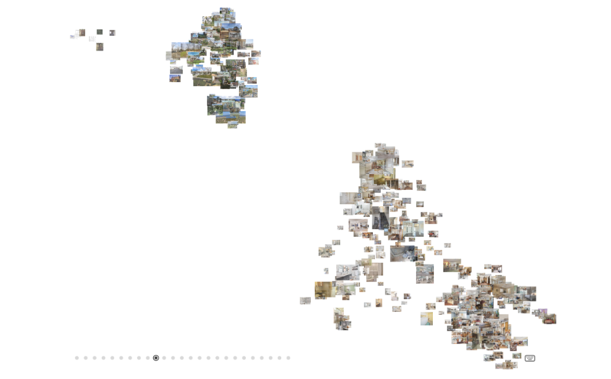
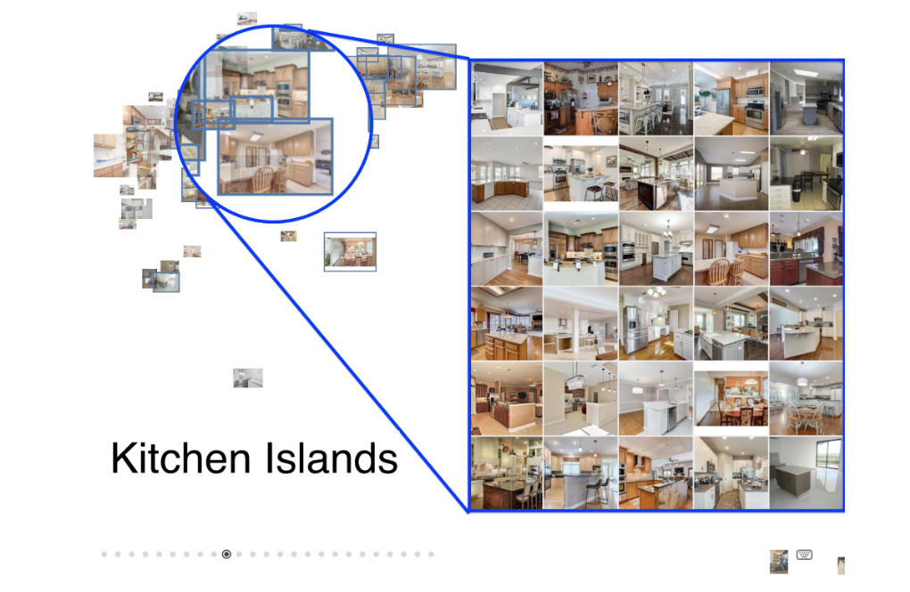
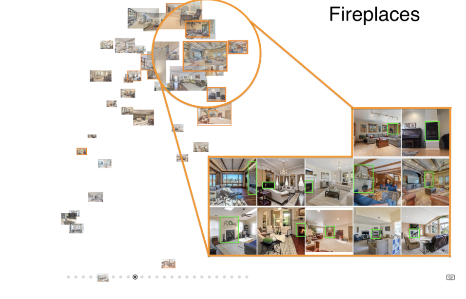
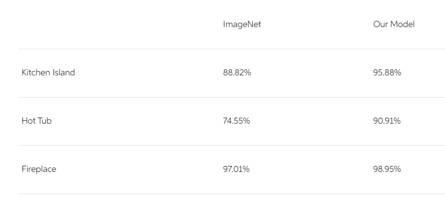
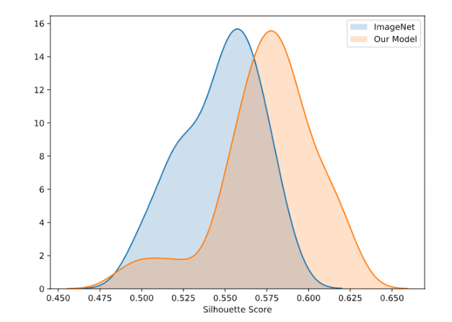

# Multi-label Image Classification

## Overview

Visual attribute search can greatly improve the user experience and SEO for home listing and travel websites. Although Zillow, Redfin, Airbnb, and TripAdvisor already have some metadata about the amenities of a property, they can expand searchable attributes by analyzing the property images using vision models.

Here is an approach towards a few-shot model for predicting property attributes like view, kitchen island, pool, high ceilings, hardwood floors, fireplace, etc. Since these attributes are often room and context-dependent, we start with an accurate classification model to group our images into interior and exterior settings of a property.

## Building a Rich Attribute Dataset

Constructed a rich attribute dataset by crawling property listing websites. The crawler captured both images and the attributes of interest.  In total 18,790 listings were obtained along with 350,000 images.

## Resnet Model with Pytorch and fastai

The images were pre-processed using fast.ai’s built-in transforms. Data was split randomly into 60% train, 20% validation and 20% test.

The model was initialized with pre-trained ResNet-34 weights. The network’s custom head was trained for 3 epochs, followed by unfreezing the entire network and fine tuning for another 10 epochs using discriminative learning rates. Fine tuning improved the model fit, achieving an overall test set accuracy of 97%.

By increasing the network capacity to a ResNet-50, 98% final accuracy was achieved - a significant improvement over the 91% accuracy of the previous results

## Results

Projects in higher dimensional space embedding

## State of the art comaparison

To evaluate a clustering solution comparing This model’s silhouette score against ImageNet. The results show that our silhouette score is significantly greater than ImageNet per t-test results on k=5 K-means clusters Silhouette score. Thus, our model produces similar clusters more consistently than ImageNet-ResNet.

